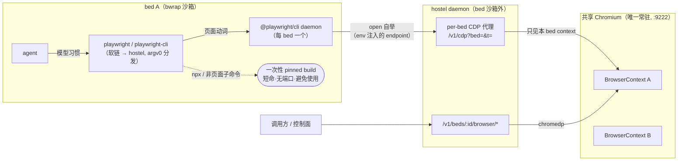

# amenity：共享设施（Chromium / Jupyter …）

> 原名 managed-service。改名 **amenity**（旅舍公共设施）：与 hostel/bed 隐喻同构——**一份设施全体住客共用，每人用自己的那一格**（厨房之于住客 ≈ Chromium 之于 bed）。

## 一、理念

1. **为什么不是每 bed 一个进程**：Chromium / Jupyter 这类进程重（启动秒级、常驻数百 MB），per-bed 起一份会吃掉共享 pod 的密度收益。但它们**天生多租户**——Chromium 有 BrowserContext（cookie/存储/缓存全隔离），Jupyter 有 kernel。amenity 框架就是把"进程级共享 + 应用原生机制切租"固化成一等公民。
2. **切片归 bed、产物落 bed**：一个 bed 的切片（BrowserContext / kernel）随 bed 生命周期走（evict/purge 时释放）；截图、下载、执行产物写进该 bed 的 `data/`——于是 file API 能读、快照会带走、别的 bed 看不见。
3. **北向不裸暴露共享进程**：browser 级 CDP websocket 能看到**所有** context——把它交给某个 bed 的调用方等于跨租户泄漏。所以对外只暴露 **bed 级动作 API**（hostel 在中间持有 CDP 连接并把动作路由到该 bed 自己的 context），不透传 browser ws。

### 与 OpenSandbox/execd 的关系（为什么无先例可抄）

execd **不管理** Chromium/Jupyter：OpenSandbox 一 sandbox 一容器，浏览器由专门镜像的 supervisor 拉起（`examples/chrome`：VNC + Chromium :9222），每容器一份、容器边界即租户边界，故可裸暴露 CDP；execd 的 `/code` 也只是既有 Jupyter server 的**客户端**（`--jupyter-host`）。hostel 的密度模型（一进程 N bed）让"每 bed 一份"不成立，共享 + 切租 + 不裸暴露成为必需——amenity 是这个模型带出的新需求，是 hostel 相对 execd 的真差集。

借鉴其客户端形态：amenity 支持 **launch-or-attach**——默认自己拉起 Chromium（`--chromium-path`），也可 attach 到既有实例（`--chromium-cdp-url`，如 sidecar/supervisor 管进程的部署形态），此时 hostel 只做切租、不管进程生死（探活仍做，失联即设施不可用）。

## 二、流程（Chromium 实例）

```
hostel 启动 → --chromium-cdp-url 设置? → attach 模式（探活既有实例）
            → 否则探测 chromium 二进制（--chromium-path / 常见路径）
              都无 → amenity 不可用，capabilities 如实上报（amenities: []）

bed 首次调用 browser 动作
  → 惰性启动共享 Chromium（headless，CDP 只听 loopback，user-data-dir 在 hostel 私有目录）
  → Target.createBrowserContext 为该 bed 建隔离 context（下载目录指到 bed 的 data/downloads）
  → 动作在该 context 内执行，产物落 bed data/

bed evict / purge / idle → ReleaseTenant → disposeBrowserContext（cookie 等运行态随之消失）
Chromium 崩溃 → 探活发现 → 重启进程，全部 tenant 失效重建（调用方视角：动作报错后重试即可）
```

## 三、关键设计

### 1. Amenity 接口（原 ManagedService 更名，语义不变）

```go
type Amenity interface {
    Name() string                                        // "chromium"
    AcquireTenant(bedID, workspace string) (Tenant, error) // 惰性建切片
    ReleaseTenant(bedID string) error                    // bed evict/purge 时
    Healthy() bool
}
```

包名 `service` → `amenity`。Registry 不变（bed 生命周期已接 `ReleaseAll`）。amenity 实现允许依赖具体协议库（chromedp），但**不允许出现 HTTP 类型**——动作到 HTTP 的映射仍在 `web/` 薄层。

### 2. 北向 API：bed 级动作，v1 刻意小

```
POST /v1/beds/:bedId/browser/goto        {url}                 → {title, url}
POST /v1/beds/:bedId/browser/text        {}                    → {text}   # 当前页可读文本
POST /v1/beds/:bedId/browser/screenshot  {path?}               → {path}   # 落 bed data/，file API 可取
POST /v1/beds/:bedId/browser/click       {selector}
POST /v1/beds/:bedId/browser/type        {selector,text,clear?}          # clear 用 focus+清空 activeElement，再 SendKeys 触发真键事件
POST /v1/beds/:bedId/browser/press       {key}                           # Enter/Tab/Escape/Arrow*/… 或单字符
POST /v1/beds/:bedId/browser/scroll      {dx?,dy?}
POST /v1/beds/:bedId/browser/wait        {selector}                      # 等元素可见（受 action timeout 约束）
POST /v1/beds/:bedId/browser/close       {}                              # 释放该 bed 的 context
```

- 动作集覆盖 goto/text/screenshot + 交互 click/type/press/scroll/wait/close，对齐内部 as serve 词汇；JS 求值（evaluate）不开放（注入面），需要时走受限的具名动作。
- **另有 per-bed CDP 代理**（见 §6）：给 bed 内 playwright / chrome-devtools-mcp 一个"看起来是自己独享浏览器"的 CDP endpoint，实为共享 Chromium 的本 bed 切片。`GET /v1/beds/:bedId/browser/info` 返回 `cdp_url`，`GET /v1/cdp?bed=&t=` 是代理 ws。

### 3. CDP 客户端选型：chromedp

用 `chromedp`（内部 sandbox 仓同款，成熟）而非手写 CDP：每 bed 的 tenant 持有一个 chromedp Context（绑定其 BrowserContext），动作即 chromedp Tasks。依赖增量可接受（纯 Go，无 cgo）。

### 4. 与既有机制的咬合

- **数据隔离**：Chromium 进程跑在 bed 沙箱**外**（hostel 同级），不经 bwrap——它是 hostel 的受管基础设施而非 bed 内代码；bed 只能通过动作 API 使用自己的切片。
- **持久化**：产物（截图/下载）在 data/ 里自然进快照;**context 运行态（cookie/localStorage）不持久**——evict 后 resume，浏览器状态从零开始（文档明示；将来可选 cookie 导出进 meta）。
- **资源隔离**：Chromium 进独立 cgroup 子组（`resource-isolation.md` 已留 `services/` 位），bed 级用量归因明确不做。
- **max-beds/背压**：tenant 数天然 ≤ bed 数，不单设上限。

### 6. per-bed CDP 代理（共享 Chromium + 每 bed 切片）

**动机**：agent 的 playwright / chrome-devtools-mcp 期望 `connectOverCDP(<endpoint>)` 连一个浏览器。pod 档 sandbox 镜像里每 pod 一个常驻 Chromium，控制面 exec 前探 `/v1/browser/info` 拿 cdp_url 注入 `PLAYWRIGHT_MCP_CDP_ENDPOINT`。弱档要对齐这套体验，但**不能给 raw browser-level CDP**——那个 socket 能看到/操作所有 bed 的页面、还能 `Browser.close` 杀掉共享进程（理念 3）。

**形态（三层，代理是关键）**：

```
bed 内 playwright  ──connectOverCDP──►  ws://127.0.0.1:8872/v1/cdp?bed=<bed>&t=<token>
                                              │  hostel CDP 代理（chromium_cdp_proxy.go）
                                              ▼  按 bed 的 BrowserContext 过滤
                                       共享 Chromium（launch，--remote-debugging-port 固定=9222）
```

- **endpoint 下发（两条路，token 均为 bed 级、mint-only）**：
  - **spawn env 注入（主）**：hostel 给每个 bed 进程注入 `PLAYWRIGHT_MCP_CDP_ENDPOINT=ws://127.0.0.1:<port>/v1/cdp?bed=&t=`——playwright-cli / playwright MCP 原生读它，bed 内零配置拿到自己的切片；
  - `GET /v1/beds/:bedId/browser/info` → 返回同一 `cdp_url`（兼容面，供控制面或 bed 内工具显式获取）。
  - 铸 token **不建 tenant 不启浏览器**（与惰性启动解耦）；真正的 ensure 推迟到**第一次代理拨号**（ServeCDP）。token 随 bed 生命周期（ReleaseTenant 时销毁），跨 Chromium 崩溃重启保持有效——客户端拿同一 URL 重连即可。
- **代理过滤**（grey-list，非穷举白名单，CDP 演进不易断）：
  - client→browser：`Target.createTarget` 强制注入本 bed 的 `browserContextId`；`Browser.close/crash*` 丢弃。
  - browser→client：`Target.targetCreated/targetInfoChanged` 属别的 context 的丢弃（兄弟 bed 的页面从不暴露）；`Target.getTargets` 响应过滤到本 bed；`Target.createBrowserContext` 响应记下新 context id（bed 自建的仍可见）。
  - 别的 bed 的 targetId 从不下发，bed 无从命名去 attach。
- **鉴权**：token 随 tenant 铸造、只经 browser/info 下发、随 tenant 消亡；`ServeCDP` 用常量时间比对，错 bed / 陈旧 token 直接拒，绝不退化成无过滤 CDP。
- **稳定 upstream**：launch 模式 chromedp 自己的 ws 端口是随机的（其 API 不暴露），故固定 `--remote-debugging-port`（`--chromium-debug-port`，默认 9222）让代理有稳定 upstream；每次代理会话经 `/json/version` 重解析 ws（浏览器崩溃/idle 重启后端口不变、ws 变）。attach 模式直接用 `CDPURL` 作 upstream。
- **诚实边界（P0）**：过滤挡"误串门"（半可信 agent、非对抗），够当前信任模型；对抗性场景下 CDP 协议面大、grey-list 可能有未覆盖的越权指令，capabilities 应披露此档浏览器隔离强度。真对抗需白名单化 + 每指令校验，属后续。
- **bed 内 CLI 客户端**：`extensions/playwright`——编进 hostel 二进制的多调用工具
  （镜像把 `playwright`、`playwright-cli` 软链到 hostel，argv[0] 分发，见
  `extensions/` 包注释），按动词路由：页面动词交给真 `@playwright/cli`（session
  未开时用 `open` 自举一次——env 已注入，open 即连到本 bed 切片，与 Chromium 的
  惰性启动对齐）、`install*` no-op（浏览器已烘焙、bed 内非 root 装不动系统依赖）、
  `open <url>` 改写为 goto（实测 session 态下 open 会另起新浏览器）、其余透传真
  playwright CLI。agent 在 bed 里即兴敲的 playwright 系命令由此全部落到本 bed 的
  代理切片上，而不是各起各的浏览器。



### 5. 部署前提：launch 或 attach

launch 模式：镜像里带 chromium/chrome 二进制（`--chromium-path` 或 PATH 探测）。attach 模式：`--chromium-cdp-url` 指向既有实例（sidecar/supervisor 部署形态，与 execd `--jupyter-host` 同构）。两者都无则该 amenity 缺席、其余功能不受影响——hostel 保持"单二进制可跑，设施按部署配置渐进点亮"。

## 实现状态

已实现（`internal/amenity/`）：`Amenity` 接口（含 `State()` 生命周期：unavailable/idle/running）+ `Registry`（amenity manager）；**chromium** 首个实例——launch-or-attach boot 探测、惰性启动、每 bed 一个 BrowserContext（cookie/存储隔离）、下载与截图落 bed `data/`、last-tenant idle-stop 自停、崩溃/停后按需重启。北向 4 端点 `POST /v1/beds/:id/browser/{goto,screenshot,text,close}`（chromedp）；capabilities 报 `amenities: {chromium: idle|running}`。真浏览器 e2e 通过（两 bed context 隔离、截图路径落对 workspace、逃逸拒绝、idle-stop、重启）。

另已实现（§6 的客户端侧）：per-bed CDP 代理（`chromium_cdp_proxy.go`，token 鉴权 + context 过滤）；bed 级 token 与 tenant 解耦（mint-only，拨号时才 ensure/启浏览器）；bed spawn env 注入 `PLAYWRIGHT_MCP_CDP_ENDPOINT`（`bed.Manager.bedEnv`）；`extensions/playwright` 多调用动词分发器。**待真机验证**：playwright 全动词真流量过 grey-list 代理（snapshot/eval 等会碰 Target.setAutoAttach 深水区）。

一个实现注意（写进代码注释）：per-bed tab 必须先在**长命 tabCtx** 上 attach 一次，否则首个动作把 target 绑到派生的超时 context，cancel 即 detach，后续动作全 hang。context 管理动作走 **browser executor**（`cdp.WithExecutor(ctx, ...Browser)`），否则 `Not allowed`。

## 非目标（v1）

- Jupyter amenity（第二个实例，验证框架通用性后加）；
- browser CDP ws 透传 / playwright 直连；
- context 状态持久化（cookie 随 evict 消失）。
